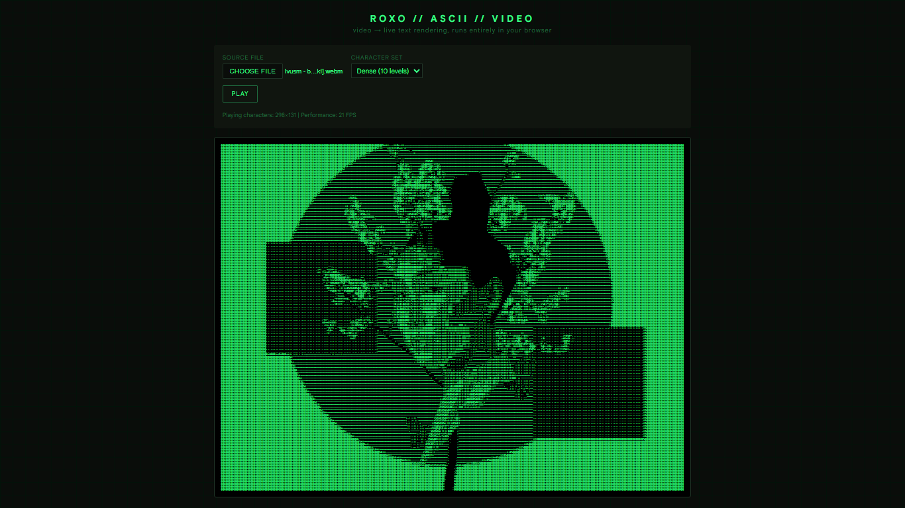

# [ROXO (ASCII Video Player)](https://roxo-ascii-player.vercel.app/)

A high-performance, browser-based digital scanning application that translates live video feeds into structural ASCII character arrays in real-time. Featuring a responsive, matrix-inspired green terminal interface, custom-styled media controls, a slow-scrolling vector grid background, and hardware-optimized rendering loops.



## Features

- **Real-Time Video Translation:** Converts raw video pixels into custom font characters up to 60 times per second utilizing CPU-efficient `requestAnimationFrame` loops.
- **Dynamic Downscaling & Tracking:** Features screen font-dimension probing via a structural memory-span (`getCharDimensions`) to calculate flawless text row-and-column aspect ratios without spilling bounds.
- **Robust Cache & Memory Safety:** Safely clears active request animation identifiers (`rafId`), breaks video pipelines, and garbage-collects media blobs (`URL.revokeObjectURL`) automatically upon subsequent file modifications.
- **Modular Density Character Sets:** Choose between multiple preset visual lookup strings (`Dense`, `Blocks`, `Binary`, `Minimal`) to vary contrast scales.
- **Slick Cyberpunk Theme:** Polished layout styling with a custom `::file-selector-button` pipeline, disabled states, uniform alignments, and a slow-scrolling parallax vector background.


## Project Architecture

```plaintext
├── index.html      
├── style.css  
├── script.js    
└── assets         
    └── image.png          
    └── icon.png          
```


## Installation & Quick Start

1. Clone or download this project repository to your local directory.
2. Open `index.html` directly inside any modern web browser (Chrome, Safari, Firefox, or Edge). *No terminal setup, Node modules, or local servers required!*
3. Upload a common video format (`.mp4`, `.webm`, `.mov`), select a visual character preset dropdown, and click **PLAY**.


## Mechanics: How It Works Under the Hood

The application converts streaming video pixels into fixed-width text rows by mimicking a hardware image processing matrix:

```
[ Upload Video ] ──> [ Downscale onto Canvas ] ──> [ Extract RGB Matrix Data ]
                                                              │
[ Render Screen Text ] <── [ Map to Character Set ] <── [ Calculate Luminance ]

```

### 1. Adaptive Grid Sizing (`getCharDimensions`)

To prevent standard text lines from breaking or wrapping early, a hidden `<span>` containing a benchmark character (`M`) is injected and checked inside the window footprint. This lets the script capture precise font pixel widths down to micro-sizes (`5px`), calculating the perfect amount of character columns that can fit in the presentation panel.

### 2. High-Speed Downscaling

Processing full-resolution 1080p video streams in text is highly inefficient. The script renders the ongoing frame array into a hidden, microscopic HTML5 `<canvas>` bounding box (e.g., $154 \times 68$ pixels) matching the target character width.

### 3. Luminance-to-Character Matrix

For every single pixel in the downscaled array, the application captures its Red, Green, and Blue sub-pixels and calculates overall perceptual human brightness via standard color science weights:

$$\text{Brightness} = \frac{(R \times 0.299) + (G \times 0.587) + (B \times 0.114)}{255}$$

This results in a float index from `0.0` (pure dark) to `1.0` (pure bright). This percentage index maps directly into your designated character string array:

* **Pure Black (`0.0`)** ➡️ Maps to an empty spacer character (`' '`).
* **Midtones (`0.5`)** ➡️ Maps to intermediate characters (`'='` or `'o'`).
* **Pure White (`1.0`)** ➡️ Maps to dense, blocky characters (`'@'` or `'█'`).

## Attribution & Credits

Demonstration Media: Contains a sample background showcase loop edited by [lbz](https://www.youtube.com/@lbzibz). You can check out the original full video edit here: [Watch LBZ's Video Edit.](https://www.youtube.com/watch?v=NIfd0txE3kI)

## License

This project is open-source and available under the terms of the MIT License.
